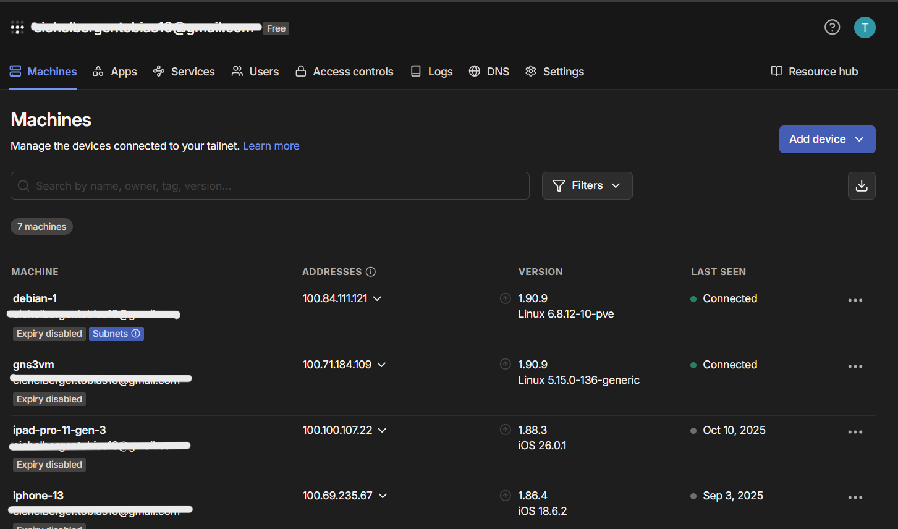
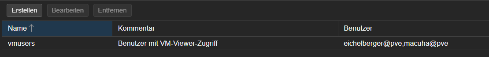
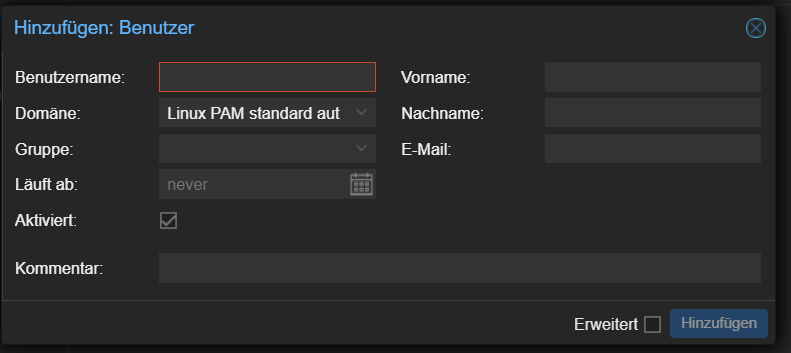
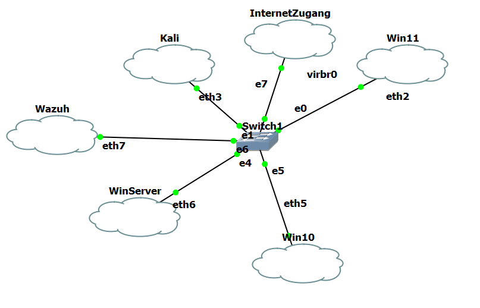
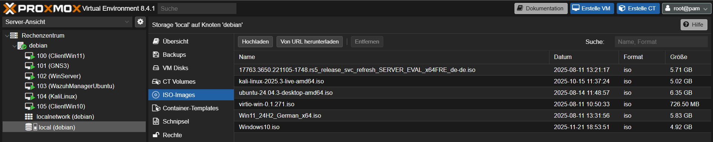
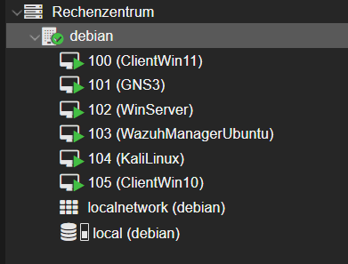
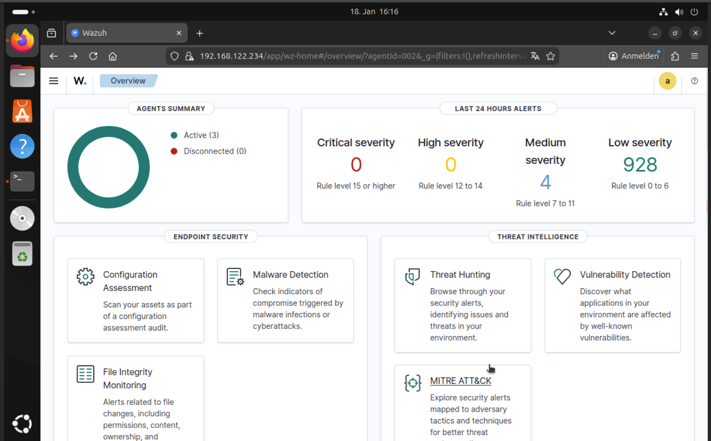
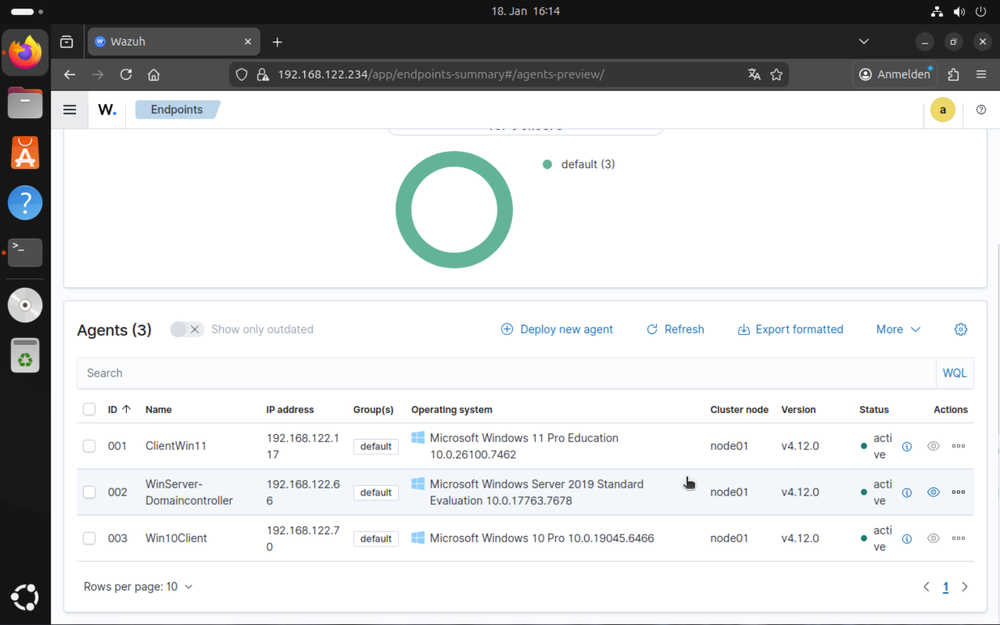
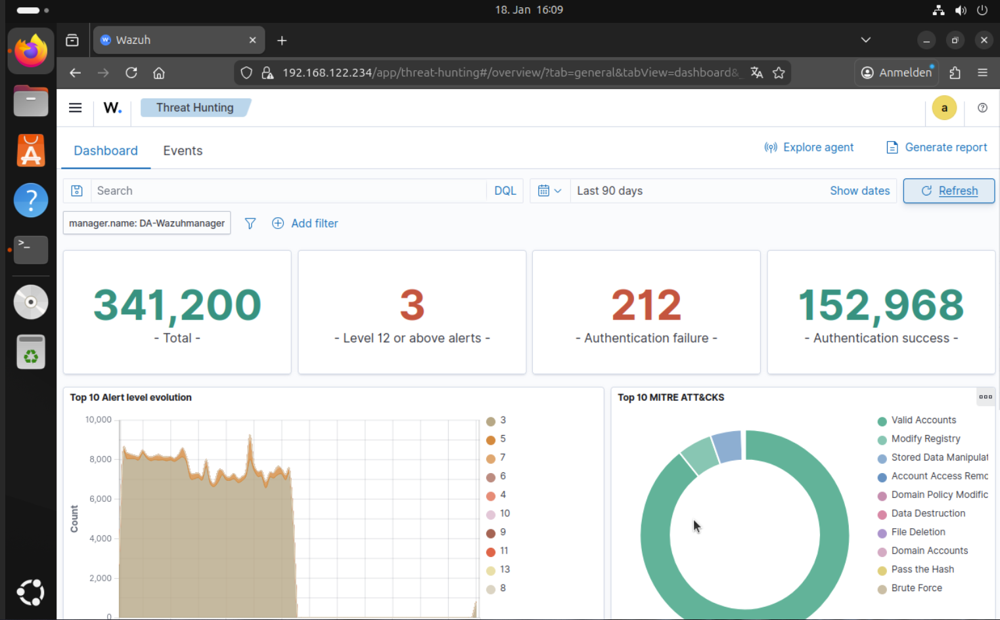

# Teilaufgabe Schüler Eichelberger
\textauthor{Tobias Eichelberger}

In dieser Teilaufgabe wird die praktische Umsetzung der in der Zielsetzung definierten serverbasierten Testumgebung beschrieben. Zunächst werden relevante theoretische Grundlagen erläutert, gefolgt von einer detaillierten Darstellung der Installations- und Konfigurationsschritte zur Realisierung der Umgebung.

## Theorie

In diesem Kapitel werden grundlegende Begriffe und Technologien erläutert, die für das Verständnis der praktischen Teilarbeit relevant sind. 

### Server
Ein Server ist ein leistungsfähiges Computersystem, das Ressourcen, Daten, Dienste oder Anwendungen zentral über ein Netzwerk bereitstellt und von Clients angefragt wird. Er übernimmt spezialisierte Aufgaben wie Webhosting, E-Mail-Verwaltung, Dateiablage oder Anwendungsbereitstellung. Entsprechend existieren unterschiedliche Serverrollen, darunter Web-, Datenbank-, Mail- und Dateiserver. Server bilden eine Kernkomponente moderner IT-Infrastrukturen und werden in Unternehmen, öffentlichen Organisationen sowie privaten Umgebungen eingesetzt. [@paessler] Eine kompakte Einführung bietet der Artikel unter `https://www.paessler.com/de/it-explained/server` (siehe Anhang).

### Debian
Debian ist ein freies Betriebssystem auf Basis des Linux-Kernels, das von einer weltweiten Entwicklergemeinschaft gepflegt wird. Es zeichnet sich durch Stabilität, Sicherheit und eine umfangreiche Paketbibliothek aus, die mehrere Tausend Softwarepakete umfasst. Debian dient als Grundlage zahlreicher Distributionen, unter anderem für Ubuntu, unterstützt viele Hardwareplattformen und bietet regelmäßige Sicherheits- und Funktionsupdates. Die Distribution verfolgt konsequent freie Software- und Open-Source-Prinzipien. [@debian] Eine ausführliche Darstellung der Eigenschaften und Vorteile findet sich unter `https://www.ionos.at/digitalguide/server/knowhow/debian-die-universelle-system-software/` (siehe Anhang).

### Proxmox
Proxmox VE (Virtual Environment) ist eine Open-Source-Plattform zur Virtualisierung von Servern und Containern. Sie basiert auf Debian Linux und nutzt KVM für die Virtualisierung kompletter Betriebssysteme sowie LXC für Containerisierung. Über eine Weboberfläche lassen sich virtuelle Umgebungen komfortabel konfigurieren, überwachen und verwalten. Proxmox unterstützt Hochverfügbarkeit, integrierte Backup-Mechanismen und eignet sich aufgrund seiner Flexibilität für Rechenzentren, Unternehmensumgebungen und IT-Dienstleister. [@proxmox] Einen praxisnahen Überblick bietet `https://www.ionos.at/digitalguide/server/knowhow/proxmox/` (siehe Anhang).

### Domaincontroller
Ein Domaincontroller (DC) verwaltet in einer Domäne zentral die Authentifizierung von Benutzern und Computern sowie die Verzeichnis- und Richtlinieninformationen. Er prüft Anmeldeinformationen und steuert den Zugriff auf Netzwerkressourcen auf Grundlage vordefinierter Richtlinien. Domaincontroller sind essenzieller Bestandteil von Active-Directory-Umgebungen und unterstützen die sichere, zentrale Administration von Identitäten und Berechtigungen. [@specops] Eine detaillierte Erläuterung findet sich unter `https://specopssoft.com/de/blog/domaenen-controller/` (siehe Anhang).

### VPN
Ein Virtual Private Network (VPN) stellt über ein öffentliches Netzwerk eine verschlüsselte, logische Punkt-zu-Punkt-Verbindung bereit. Dadurch bleiben IP-Adressen verborgen, und Daten werden vor unbefugtem Zugriff geschützt. VPNs erhöhen die Privatsphäre, ermöglichen den Zugriff auf interne Unternehmensressourcen und helfen beim Umgehen geografischer Beschränkungen. Sie bieten insbesondere in öffentlichen WLANs eine zusätzliche Sicherheitsschicht. [@ryte] Grundlagen und Vorteile sind unter `https://de.ryte.com/wiki/VPN/` (siehe Anhang) beschrieben.

#### Tailscale
Tailscale ist ein VPN auf Basis des WireGuard-Protokolls, das Geräte standortunabhängig über ein Peer-to-Peer-Modell verbindet. Es automatisiert Konfiguration und Schlüsselverwaltung, bietet eine webbasierte Verwaltung und benötigt keinen zentralen Gateway-Server. Tailscale eignet sich für kleine Teams ebenso wie für Unternehmen, die eine einfach administrierbare, sichere Vernetzung benötigen. [@tailscale] Eine Einführung liefert `https://tailscale.com/kb/1151/what-is-tailscale` (siehe Anhang).

### GNS3
Der Graphical Network Simulator-3 (GNS3) ist eine Open-Source-Lösung zur Netzwerksimulation und -emulation. Er ermöglicht das Abbilden komplexer Topologien ohne physische Hardware und unterstützt reale Netzwerkbetriebssysteme wie Cisco IOS oder Juniper Junos. Eine grafische Oberfläche erlaubt das Platzieren und Konfigurieren von Geräten per Drag-and-Drop. GNS3 wird für Schulungen, Testumgebungen und Entwicklungsaufgaben genutzt. [@gns3] Die Dokumentation steht unter `https://docs.gns3.com/docs/` (siehe Anhang) bereit.

### IDS-System
Ein Intrusion-Detection-System (IDS) erkennt unerwünschte oder schädliche Aktivitäten in IT-Systemen und Netzwerken. Es existieren hostbasierte (HIDS) und netzwerkbasierte Varianten (NIDS), die Ereignisse analysieren und bei Auffälligkeiten alarmieren. Eine Einführung zu Funktionsweise, Typen und Einsatzgründen bietet `https://www.ionos.at/digitalguide/server/sicherheit/intrusion-detection-system-ids/` [@ionos] (siehe Anhang).

Mit zunehmender Digitalisierung steigt die Relevanz solcher Überwachungssysteme, da Unternehmensnetzwerke vermehrt Angriffen ausgesetzt sind. IDS-Lösungen helfen, Angriffe frühzeitig zu erkennen und Schäden zu begrenzen.

#### Vergleich zwischen verschiedenen IDS-Systemen
Für die Projektauswahl wurden drei etablierte IDS-Lösungen mit unterschiedlichen Ansätzen bewertet.

##### Wazuh
Wazuh ist ein Open-Source-HIDS (hostbasiertes Intrusion-Detection-System) und steht in einer kostenfreien sowie in kommerziellen Varianten mit unterschiedlichen Service-Modellen zur Verfügung. Es besteht aus einem Server, einem Indexer und Agenten, die auf Endgeräten installiert werden. Der Server sammelt Ereignisdaten der Agenten, der Indexer speichert sie, und ein webbasiertes Dashboard stellt die Informationen bereit. Empfohlen wird der Betrieb des Wazuh-Servers auf Linux. Ausführliche Informationen finden sich in der offiziellen Dokumentation: `https://documentation.wazuh.com/current/index.html` [@wazuh].

##### Snort
Snort ist ein netzwerkbasiertes IDS (NIDS) und ebenfalls Open Source, neben der kostenfreien Version existiert eine kostenpflichtige kommerzielle Variante. Snort analysiert den gesamten Netzwerkverkehr, erkennt Anomalien und potenziell schädliche Pakete und fungiert damit als Paket-Sniffer. Im Unterschied zu HIDS-Lösungen wird Snort zentral auf einem Netzwerkgerät, typischerweise einem Server, betrieben. Für die Visualisierung der Logdaten ist ein separates Frontend erforderlich. Die offizielle Dokumentation befindet sich unter `https://www.snort.org/documents` [@snort]; eine ergänzende Einführung bietet `https://www.zenarmor.com/docs/de/netzwerksicherheitstutorials/was-ist-snort#:~:text=Snort%20untersucht%20den%20Netzwerkverkehr%20in,au%C3%9Ferhalb%20eines%20Netzwerks%20gesendet%20werden` [@zenarmor_snort].

##### Security Onion
Security Onion ist eine Open-Source-Lösung, die host- und netzwerkbasierte Erkennung in einem hybriden Ansatz kombiniert. Die Plattform wird zentral auf einem Server betrieben, verwendet Suricata für das netzwerkbasierte Scannen und den Elastic-Agenten für das hostbasierte Monitoring. Ereignisse werden konsolidiert auf einem Dashboard dargestellt. Die Dokumentation ist unter `https://docs.securityonion.net/en/2.4/index.html` [@securityonion] verfügbar.

## Praktische Arbeit

In diesem Kapitel wird die schrittweise Umsetzung der serverbasierten Testumgebung beschrieben. Beginnend mit der Installation und Konfiguration des Proxmox-Servers, über die Einrichtung des Tailscale-VPNs und des GNS3-Servers, bis hin zum Aufsetzen der virtuellen Maschinen, der Implementierung des IDS-Systems und der Konfiguration des Windows-Domaincontrollers.

### Installation und Konfiguration des Proxmox-Servers
Für die Umsetzung wurde ein HP ProLiant G7 mit 805 Gigabyte Massenspeicher, 70 Gigabyte Arbeitsspeicher und vier CPUs eingesetzt.

#### Installation von Debian 12
Debian 12 wurde heruntergeladen und mit balenaEtcher auf einen USB-Stick als bootfähiges Installationsmedium übertragen. Der Server wird von diesem Medium gestartet, der Installationsanleitung gefolgt und ein Root-Passwort vergeben, um spätere Konfigurationsprobleme zu vermeiden. Bei der Softwareauswahl sollte ausschließlich das Standardsystem aktiviert sein.

Tritt nach der Installation ein Bootfehler auf, liegt dies häufig an einem fehlerhaft platzierten GRUB-Bootloader. Im Rescue-Modus lässt sich die korrekte Festplatte auswählen. Nach erfolgreichem Start steht die Shell des Debian-Systems für die weiteren Schritte bereit.

Eine statische IP-Adresse ist erforderlich, um Proxmox ohne Netzwerkfehler zu betreiben. In `/etc/network/interfaces` wird der Eintrag „dhcp“ des betreffenden Adapters durch „static“ ersetzt; anschließend werden IP-Adresse, Netzmaske und Gateway gemäß Netzplan eingetragen. Nach dem Speichern (Strg+O) und Schließen (Strg+X) folgt die Anpassung von `/etc/hosts`: In der ersten Zeile wird „localhost“ zu „localhost.localdomain localhost“, in der zweiten die korrekte IP-Adresse ergänzt. Mit `hostname --ip-address` lässt sich die Konfiguration überprüfen. Danach werden die Netzwerkschnittstellen mit `ifdown <Adapter>` und `ifup <Adapter>` neu geladen und via `ip a` kontrolliert.

#### Installation von Proxmox
Für die Installation wird die Datei `/etc/apt/sources.list.d/pve-install-repo` erstellt und um folgende Zeile ergänzt: `deb [arch=amd64] http://download.proxmox.com/debian/pve bullseye pve-no-subscription`. Der Proxmox-GPG-Schlüssel wird mit `wget http://download.proxmox.com/debian/proxmox-release-bullseye.gpg -O /etc/apt/trusted.gpg.d/proxmox-release-bullseye.gpg` hinterlegt. Anschließend werden die Paketquellen mit `apt update` und `apt full-upgrade` aktualisiert, bevor `apt install proxmox-ve postfix open-iscsi proxmox` ausgeführt wird. Während der Postfix-Konfiguration ist die Option „Internet Site“ zu wählen und der Systemmailname mit der Server-Domain zu setzen. Vor dem Neustart empfiehlt sich `apt remove os-prober`, um potenzielle Konflikte zu vermeiden. Nach dem Reboot erscheint der Proxmox-VE-Bootmanager.

Das Webinterface wird von einem externen Rechner über `https://<Server-IP>:8006` aufgerufen. Die Zertifikatswarnung kann in diesem Kontext übersprungen werden. Die Anmeldung erfolgt mit dem Benutzer „root“ und dem zuvor gesetzten Root-Passwort; als Domaine muss „Linux PAM standard authentication“ gewählt werden. Im Anschluss werden unter „Datacenter > Updates“ die Paketlisten aktualisiert („Refresh“) und die verfügbaren Aktualisierungen installiert („Upgrade“). Ein weiterer Neustart stellt sicher, dass alle Updates aktiv sind.

Für die spätere Anbindung der virtuellen Maschinen über GNS3 werden virtuelle Bridges erstellt. Unter dem jeweiligen Node führt „Network > Create > Linux Bridge“ zur Anlage der benötigten Bridges; je VM wird eine eigene Bridge vorgesehen. Zusätzlich wird eine allgemeine Bridge mit dem physischen Adapter (z.B. eth0) als „Bridge port“ angelegt, um Internetzugang bereitzustellen. [@installProxmox]

### Einrichten des Tailscale-VPNs
Zur Erreichbarkeit des Proxmox-Servers außerhalb des lokalen Netzes wird Tailscale eingesetzt. Das Repository wird per `curl -fsSL https://tailscale.com/install.sh | sh` eingebunden, anschließend erfolgt die Installation mit `apt-get install tailscale`. Nach `tailscale up` erzeugt Tailscale einen Authentifizierungslink, der im Browser geöffnet wird, um den Server dem Tailscale-Netzwerk hinzuzufügen. Der Status lässt sich mit `tailscale status` prüfen. Damit der Dienst beim Systemstart aktiv wird, wird `systemctl enable tailscaled` gesetzt. [@installTailscale]

#### Installation von Tailscale auf Endgeräten
Die jeweiligen Installationspakete sind unter `https://tailscale.com/download` verfügbar. Nach der Installation auf den Clients wird der Authentifizierungsdialog durchlaufen, sodass die Geräte ihre Tailscale-IP erhalten und standortunabhängig miteinander kommunizieren können. Über das Tailscale-Dashboard lassen sich alle eingebundenen Geräte verwalten und überwachen, wie im folgenden Bild dargestellt. 

### Einrichten der Benutzer auf dem Proxmox-Server
Um den Betrieb ohne Root-Zugriff zu ermöglichen, werden rollenbasierte Berechtigungen eingerichtet. Unter „Datacenter > Permissions > Roles“ wird eine neue Rolle (z.B. „NurVMsSehen“) mit den benötigten Rechten (z.B. „PVEAuditor“, „VM.Console“) erstellt. Anschließend wird unter „Groups“ eine Gruppe (z.B. „VMUser“) angelegt und mit der Rolle verknüpft, wenn diese erstellt wurde, sollte sie in der Liste erscheinen, wie im folgenden Bild zu sehen ist.

Unter „Users“ werden individuelle Benutzerkonten erzeugt, die der Gruppe zugewiesen werden. Die Rechte der Nutzer sind damit auf den in der Rolle definierten Umfang begrenzt, wodurch die Sicherheit erhöht wird und die Schülerinnen und Schüler nur die vorgesehenen Funktionen nutzen können. Zur Erstellung eines Benutzers auf "erstellen" klicken, Benutzername, Passwort und Gruppe (z.B. „VMUser“) angeben und speichern, wie im folgenden Bild dargestellt.

### Einrichten des GNS3-Servers
Zunächst wird das GNS3-VM-Image von `https://gns3.com/software/download-vm` geladen und über „Storage > Content > Upload“ in Proxmox bereitgestellt. Die VM wird mit „Create VM“ angelegt (z.B. Name „GNS3-Server“), als BIOS „OVMF (UEFI)“ und als Bus/Device „SCSI“ gewählt und das hochgeladene Image als Storage hinterlegt. CPU (z.B. 2 Kerne) und RAM (z.B. 4096 MB) werden zugewiesen; als Bridge wird die allgemeine virtuelle Bridge (z.B. vmbr1) konfiguriert. Nach dem Anlegen werden zusätzliche Netzwerkkarten für die übrigen Bridges ergänzt.

Nach dem Start der VM wird auf der Konsole das Passwort für den Benutzer „gns3“ mittels `passwd` geändert. Die Netzwerkkonfiguration lässt sich mit `ip a` prüfen und bei Bedarf anpassen. Der GNS3-Client auf einem externen Rechner verbindet sich unter „Edit > Preferences > GNS3 Server“ mit der IP des Servers; außerhalb des lokalen Netzes kann die Tailscale-IP genutzt werden wenn auf dem GNS3-Server Tailscale installiert ist. Ein erfolgreicher Verbindungstest ermöglicht anschließend die Projektanlage und Topologieerstellung.

### Virtuelle Netzwerktopologie in GNS3 erstellen
In GNS3 wird zunächst ein Switch auf die Arbeitsfläche gezogen. Für jede zuvor angelegte Bridge wird ein Cloud-Element hinzugefügt und jeweils genau ein Adapter aktiviert und entsprechend benannt. Sämtliche Clouds werden mit dem Switch verbunden. Für den Internetzugang wird eine zusätzliche Cloud eingebunden, die den „VirtIo“-Adapter nutzt. Die Topologie ist damit vollständig, und sollte wie im folgenden Bild dargestellt aussehen. Die virtuellen Maschinen können sowohl untereinander als auch mit dem Internet kommunizieren.

Der Ansatz ermöglicht eine flexible Anpassung der Topologie, etwa das Hinzufügen von Firewalls oder weiteren Netzwerkgeräten, ohne Änderungen an den Proxmox-Netzwerkeinstellungen der VMs. So können unterschiedliche Szenarien erprobt werden, ohne die reale Infrastruktur zu beeinträchtigen.

### Aufsetzen der virtuellen Maschinen
Die folgenden Betriebssystem-Images wurden als ISO-Dateien heruntergeladen und über „Storage > Content > Upload“ in Proxmox bereitgestellt:

- Windows 11
- Windows 10
- Windows Server 2019
- Ubuntu 22.04 LTS
- Kali Linux

Im folgenden Bild ist der Upload der ISO-Dateien dargestellt.

Nach dem Upload werden die VMs erstellt.

#### Windows 10 VM
Die VM wird über „Create VM“ angelegt (z.B. Name „Windows10-Client“). Unter „OS“ wird die Windows-10-ISO ausgewählt, unter „System“ BIOS „OVMF (UEFI)“, unter „Hard Disk“ Bus/Device „SCSI“ sowie Speichergröße (z.B. 60 GB) definiert. CPU (z.B. 2 Kerne) und RAM (z.B. 4096 MB) werden zugewiesen; unter „Network“ wird die für diese VM vorgesehene Bridge gewählt. Anschließend erfolgt die Installation des Betriebssystems.

#### Windows 11 VM
Analog zur Windows-10-VM, jedoch mit der Windows-11-ISO und beispielsweise 80 GB Festplattengröße. Die passende Bridge ist auszuwählen.

#### Windows Server 2019 VM
Die VM (z.B. „WindowsServer2019“) erhält die Windows-Server-2019-ISO, BIOS „OVMF (UEFI)“, Bus/Device „SCSI“, Speicher (z.B. 100 GB), CPU (z.B. 4 Kerne) und RAM (z.B. 8192 MB). Die passende Bridge wird gesetzt, anschließend erfolgt die Installation.

#### Ubuntu VM
Für die VM (z.B. „Ubuntu-Server“) werden die Ubuntu-22.04-LTS-ISO, BIOS „OVMF (UEFI)“, Bus/Device „SCSI“, Speicher (z.B. 50 GB), CPU (z.B. 2 Kerne) und RAM (z.B. 4096 MB) konfiguriert. Nach Auswahl der Bridge wird Ubuntu installiert.

#### Kali Linux VM
Die Kali-VM (z.B. „Kali-Linux“) nutzt die Kali-Linux-ISO, BIOS „OVMF (UEFI)“, Bus/Device „SCSI“, Speicher (z.B. 50 GB), CPU (z.B. 2 Kerne), RAM (z.B. 4096 MB) und die zugehörige Bridge. Danach wird das Betriebssystem installiert.

Nach Abschluss stehen alle VMs im Proxmox-Webinterface zur Verfügung, wie im Bild ersichtlich, und können verwaltet werden.

Für die weitere Arbeit erhalten alle VMs statische IP-Adressen im selben Subnetz (IP, Subnetzmaske, Gateway, DNS). Die Erreichbarkeit wird mit `ping <Ziel-IP>` geprüft. Blockiert eine lokale Firewall ICMP-Verkehr, ist dieser für die Tests freizugeben.

### Implementierung des IDS-Systems
Als IDS wird Wazuh eingesetzt. Auf der Ubuntu-22.04-LTS-VM wird der Wazuh-Server mit `curl -sO https://packages.wazuh.com/4.14/wazuh-install.sh && sudo bash ./wazuh-install.sh -a` installiert. Nach Abschluss erscheinen die Zugangsdaten und die Dashboard-IP. [@installWazuh]

Die Wazuh-Agenten werden auf den übrigen VMs installiert. Der Windows-Installer wird von der offiziellen Website geladen und per PowerShell angebunden, beispielsweise mit `./wazuh-agent-4.14.1-1.msi /q WAZUH_MANAGER="<IP-AdresseDesWazuhServers>"`. Anschließend wird der Dienst mit `Start-Service wazuhsvc` gestartet. Die Schritte werden auf allen relevanten Maschinen (hier Windows Server, Windows 10 und Windows 11) wiederholt. Nach erfolgreicher Registrierung erscheinen die Ereignisse im Wazuh-Dashboard. [@installWazuhAgent]

### Windows Server als Domaincontroller einrichten
Auf dem Windows Server 2019 wird über den Server-Manager die Rolle „Active Directory-Domänendienste“ installiert. Nach der Installation erfolgt die Hochstufung zum Domaincontroller über „Promote this server to a domain controller“. Für den neuen Forest wird ein Domänenname (z.B. „datelm.local“) vergeben; die Standardpfade und Einstellungen werden übernommen. Nach Abschluss startet der Server neu und fungiert als Domaincontroller. [@adInstallation]

#### Benutzer im Active Directory anlegen
In „Active Directory-Benutzer und -Computer“ werden unter der Domäne im Ordner „Users“ neue Benutzer erstellt. Für jeden Benutzer werden Name, Anmeldename und ein Passwort gemäß Richtlinie vergeben. Dieser Vorgang wird für alle benötigten Konten wiederholt.

### Windows 10 Client in die Domäne einbinden
Voraussetzung ist, dass der Client als DNS-Server die IP des Domaincontrollers nutzt. Unter „Einstellungen > System > Info > Diesen PC umbenennen (erweiterte Einstellungen)“ wird „Domäne“ gewählt und der Domänenname (z.B. „datelm.local“) eingetragen. Nach Eingabe von Domänen-Anmeldedaten wird die Aufnahme bestätigt und der Rechner neu gestartet. Anschließend ist eine Anmeldung mit Domänenkonto möglich. [@joinDomain]

### Windows 11 Client in die Domäne einbinden
Die Einbindung erfolgt analog zum Windows-10-Client; dieselben Schritte werden angewendet.

### Wazuh-Dashboard
Nach Anmeldung im Wazuh-Dashboard werden auf der Startseite die verbundenen Endpunkte („Endpoints“) und die Ereignisse der letzten 24 Stunden angezeigt, wie im folgenden Bild dargestellt.

Über „Agents management > Summary“ lassen sich alle angebundenen Endpunkte einsehen, wie im folgenden Bild dargestellt.

Durch Auswahl eines Endpunkts werden dessen Ereignisse und Warnungen angezeigt, die nach Datum, Schweregrad und Kategorie filterbar sind. Unter dem Tab „Threat Hunting“ erscheinen sämtliche Ereignisse im Detail, wie im folgenden Bild zu sehen ist.

Das Dashboard ermöglicht damit die kontinuierliche Überwachung potenzieller Bedrohungen und unterstützt die Bewertung sowie Reaktion auf sicherheitsrelevante Ereignisse.
