# Teilaufgabe Schüler Macuha
\textauthor{Lukas Macuha}

In dieser Teilaufgabe wird die praktische Umsetzung eines vollständigen Angriffspfads in einer Active-Directory-Testumgebung beschrieben. Zunächst werden die theoretischen Grundlagen zu den verwendeten Technologien und Angriffstechniken erläutert, gefolgt von einer detaillierten Darstellung der praktischen Arbeit, einschließlich der Durchführung der Angriffe und der Analyse der Ergebnisse.

## Theorie

In diesem Kapitel werden grundlegende Begriffe und Technologien erläutert, die für das Verständnis der praktischen Teilarbeit relevant sind.

### Kerberos

Kerberos ist ein etabliertes Authentifizierungsprotokoll, das in Active Directory standardmäßig verwendet wird und auf Prinzipien der sicheren Netzwerkkommunikation basiert, die ursprünglich am Massachusetts Institute of Technology (MIT) entwickelt wurden. Es funktioniert auf Basis von Tickets und nutzt symmetrische Verschlüsselung, um die Identitäten von Benutzern, Diensten und Geräten innerhalb eines Netzwerks sicher und zuverlässig zu überprüfen, ohne dass Passwörter über das Netzwerk gesendet werden müssen [@microsoft_kerberos] `https://learn.microsoft.com/en-us/windows-server/security/kerberos/kerberos-authentication-overview` (siehe Anhang). Der zentrale Bestandteil von Kerberos ist das sogenannte Key Distribution Center (KDC), welches typischerweise auf dem Domaincontroller läuft und für die Ausstellung und Validierung von Tickets verantwortlich ist. Kerberos arbeitet in mehreren präzisen Schritten, um eine hohe Sicherheit zu gewährleisten: Zunächst authentifiziert sich ein Benutzer am KDC und erhält ein Ticket Granting Ticket (TGT), das als eine Art "Eintrittskarte" dient und mit dem Hash des Benutzerpassworts verschlüsselt ist. Mit diesem TGT kann der Benutzer anschließend ein Service Ticket (TGS) für bestimmte Dienste oder Ressourcen anfordern, ohne sich erneut anmelden zu müssen. Diese Tickets sind zeitlich begrenzt, um Missbrauch zu verhindern, und kryptografisch geschützt, oft mit Algorithmen wie AES [@Hack_The_Box_kerberos] `https://www.hackthebox.com/blog/what-is-kerberos-authentication` (siehe Anhang). Ein Service Account ist ein spezielles Benutzerkonto im Active Directory, das ausschließlich für die Ausführung von Diensten oder Anwendungen und nicht für menschliche Interaktionen vorgesehen ist. Schwachstellen entstehen vor allem dann, wenn solche Service Accounts mit schwachen, leicht zu knackenden Passwörtern konfiguriert werden, oder wenn die Verschlüsselung nicht auf dem neuesten Stand ist, was Angreifern Türen öffnet, um das System zu kompromittieren

### Kerberoasting

Kerberoasting ist eine raffinierte Angriffstechnik auf Active Directory, in dem ein Angreifer Service Tickets (TGS) für Dienste mit registrierten Service Principal Names (SPN) anfordert, die in der Domäne konfiguriert sind, wie beispielsweise für SQL-Server oder Webdienste. Diese Tickets sind mit dem Passwort-Hash des jeweiligen Service Accounts verschlüsselt, was sie zu einem wertvollen Ziel macht, da sie Informationen über die zugrunde liegenden Credentials enthalten [@crowd_Strike_kerberos] `https://www.crowdstrike.com/en-us/cybersecurity-101/cyberattacks/kerberoasting/` (siehe Anhang). Da jeder authentifizierte Domänenbenutzer, selbst mit niedrigen Rechten, solche Tickets ohne besondere Berechtigungen anfordern darf, kann ein Angreifer diese Tickets sammeln und sie offline, also außerhalb des Netzwerks, analysieren. Mit geeigneten Tools wie Hashcat oder John the Ripper versuchen sie dann, das zugrunde liegende Passwort durch Brute-Force- oder Dictionary-Attacken zu knacken [@sentinelone_kerberoasting] `https://www.sentinelone.com/cybersecurity-101/threat-intelligence/what-is-kerberoasting-attack/` (siehe Anhang). Besonders gefährlich ist diese Technik, da das eigentliche Knacken offline erfolgt und somit keine weiteren Logs oder Spuren auf dem Domaincontroller erzeugt werden, was die Entdeckung durch Sicherheitsüberwachungssysteme erschwert und den Angreifer lange unentdeckt lassen kann [@netwrix_kerberos] `https://netwrix.com/en/cybersecurity-glossary/cyber-security-attacks/kerberoasting/` (siehe Anhang).

### DCSync-Angriff

Ein DCSync-Angriff ist eine subtile und hochgefährliche Methode, die die normale Replikationsfunktion von Active Directory ausnutzt, um sensible Daten zu extrahieren. Domaincontroller replizieren regelmäßig Verzeichnisdaten untereinander, um Konsistenz in der gesamten Domäne oder Forest zu gewährleisten, was ein essenzieller Bestandteil der Active-Directory-Architektur ist und für die Verfügbarkeit und Redundanz sorgt [@tenable_DCSync] `https://docs.tenable.com/identity-exposure/SaaS/Content/User/AttackPath/DCSync.htm` (siehe Anhang). Konten mit speziellen Rechten, wie beispielsweise Replicate Directory Changes All, dürfen diese Replikationsdaten legitim anfordern, um Änderungen zu synchronisieren. Hat ein Angreifer Zugriff auf ein solches Konto mit diesen erweiterten Rechten, oft durch vorherige Kompromittierungen erreicht, kann er die Passwort-Hashes aller Benutzer, inklusive hochsensibler Administratoren und des besonders kritischen krbtgt-Kontos, abrufen, ohne dass zusätzliche Werkzeuge oder Exploits benötigt werden [@sentinelone_dcsync] `https://www.sentinelone.com/blog/active-directory-dcsync-attacks/` (siehe Anhang). Der Angriff ist besonders kritisch, da er keine traditionellen Exploits oder Schwachstellen ausnutzt, sondern legitime Active-Directory-Funktionen missbraucht, was ihn schwer zu erkennen macht und potenziell zu einer vollständigen Übernahme der Domäne führen kann, mit langfristigen Konsequenzen für die Sicherheit des gesamten Netzwerks [@fidelis_dcsync] `https://fidelissecurity.com/cybersecurity-101/cyberattacks/dcsync-attack/` (siehe Anhang).

### Golden-Ticket-Angriff

Ein Golden Ticket ist ein gefälschtes Kerberos Ticket Granting Ticket (TGT), das von einem Angreifer erstellt wird, um uneingeschränkten Zugriff auf die Domäne zu erlangen. Die Voraussetzung für diesen Angriff ist der Besitz des Passwort-Hashes des krbtgt-Kontos, das als das „Goldene Konto" gilt, da es alle Kerberos-Tickets innerhalb einer Domäne signiert und somit die Integrität des gesamten Authentifizierungssystems gewährleistet [@crowdstrike_golden_ticket] `https://www.crowdstrike.com/en-us/cybersecurity-101/cyberattacks/golden-ticket-attack/` (siehe Anhang). Mit einem solchen Golden Ticket kann sich ein Angreifer als beliebiger Benutzer ausgeben, inklusive hochprivilegierter Domain Administratoren oder sogar Systemkonten, ohne dass echte Credentials benötigt werden. Diese Tickets können sehr lange gültig sein, oft Jahre, und ermöglichen einen nahezu unsichtbaren und dauerhaften Zugriff auf die Domäne, da sie nicht auf normale Authentifizierungslogs zurückgreifen und somit unter dem Radar der Sicherheitsüberwachung bleiben [@picus_golden_ticket] `https://www.picussecurity.com/resource/blog/golden-ticket-attack-mitre-t1558.001` (siehe Anhang). Der Angriff kann nur effektiv gestoppt werden, indem das krbtgt-Passwort zweimal zurückgesetzt wird, was die Signatur aller Tickets invalidiert und den Angreifer aussperrt, aber dies erfordert sorgfältige Planung, um den Betrieb nicht zu stören [@hornetsecurity_golden_ticket] `https://www.hornetsecurity.com/en/blog/golden-ticket-attack/` (siehe Anhang).

### Impacket

Impacket ist eine vielseitige Sammlung von Python-Bibliotheken und Tools, die speziell für die Arbeit mit Netzwerkprotokollen entwickelt wurden und in der IT-Sicherheit eine zentrale Rolle spielen, insbesondere bei Penetrationstests und der Analyse von Windows-basierten Systemen [@jumpcloud_impacket] `https://jumpcloud.com/it-index/what-is-impacket` (siehe Anhang). Diese Open-Source-Lösung, die von Core Security gepflegt wird, ermöglicht die Implementierung und Manipulation von Protokollen wie SMB, MSRPC, Kerberos und WMI, was sie zu einem unverzichtbaren Werkzeug für Sicherheitsforscher und Ethical Hacker macht, die Schwachstellen in Netzwerken aufdecken und ausnutzen möchten. Impacket bietet eine Reihe von Skripten, darunter secretsdump.py für die Extraktion von Credentials aus SAM-Dateien oder NTDS.dit, sowie smbexec.py für die Ausführung von Befehlen über SMB, und unterstützt damit eine breite Palette an Szenarien von der Authentifizierung bis hin zur Remote-Code-Ausführung [@logpoint_impacket] `https://logpoint.com/en/blog/the-impacket-arsenal-a-deep-dive-into-impacket-remote-code-execution-tools` (siehe Anhang). Ein wesentlicher Vorteil von Impacket liegt in seiner Flexibilität und der Fähigkeit, legitime Windows-Funktionen zu missbrauchen, ohne dass zusätzliche Exploits benötigt werden, was es Angreifern ermöglicht, unauffällig in Domänen vorzudringen und sensible Daten wie Passwort-Hashes oder Kerberos-Tickets zu erbeuten. Da die Tools auf Python basieren, sind sie plattformübergreifend einsetzbar, etwa auf Kali Linux, und integrieren sich nahtlos in andere Frameworks wie Metasploit [@kali_impacket] `https://www.kali.org/tools/impacket/` (siehe Anhang). Besonders gefährlich ist Impacket in den Händen von Cyberkriminellen, da es eine vollständige Kompromittierung von Netzwerken erleichtern kann, indem es Protokolle wie SMB für Lateral Movement nutzt, was zu Datenexfiltration oder Ransomware-Angriffen führen kann, ohne dass herkömmliche Sicherheitslösungen es sofort erkennen. Dennoch wird es ethisch von Sicherheitsprofis genutzt, um Schwachstellen zu identifizieren und Systeme zu härten, solange es verantwortungsvoll eingesetzt wird [@redcanary_impacket] `https://redcanary.com/threat-detection-report/threats/impacket/` (siehe Anhang).

### Nmap

Nmap ist ein leistungsstarkes und weit verbreitetes Open-Source-Tool für das Netzwerkscanning und die Netzwerkerkundung, das von Gordon Lyon entwickelt wurde und in der IT-Sicherheit als Standardwerkzeug für die Entdeckung von Hosts, offenen Ports und laufenden Diensten gilt. Als Network Mapper bezeichnet, sendet es gezielt Pakete an Zielsysteme und analysiert die Antworten, um detaillierte Informationen über die Netzwerktopologie zu sammeln, einschließlich Betriebssystemversionen, Service-Details und potenzieller Schwachstellen [@geeksforgeeks_nmap] `https://www.geeksforgeeks.org/linux-unix/what-is-nmap-a-comprehensive-guide-for-network-mapping/` (siehe Anhang). Nmap unterstützt eine Vielzahl von Scan-Techniken, wie TCP-SYN-Scans für unauffällige Erkundungen oder UDP-Scans für die Überprüfung von offenen Ports, und kann mit Skripten aus der NSE (Nmap Scripting Engine) erweitert werden, um automatisierte Vulnerabilitätschecks durchzuführen. Da Nmap sowohl für kleine als auch für große Netzwerke skalierbar ist und Optionen wie Rate-Limiting bietet, um Entdeckung zu vermeiden, ist es ein essenzielles Tool für Penetrationstester, die Schwachstellen kartieren und Angriffsvektoren identifizieren möchten. Mit Befehlen wie „nmap -sS -p- [IP-Bereich]" können Administratoren offene Ports scannen und Dienste wie SMB oder RDP aufspüren, was hilft, Sicherheitslücken frühzeitig zu schließen [@nmap_manual] `https://nmap.org/book/man.html` (siehe Anhang). Besonders nützlich ist Nmap in der Reconnaissance-Phase von Angriffen, da es ohne hohe Rechte funktioniert und detaillierte Berichte erzeugt, die die Basis für weitere Exploits bilden können, was es zu einem zweischneidigen Schwert macht: wertvoll für Defender, aber gefährlich, wenn es von Angreifern genutzt wird, um Netzwerke zu kompromittieren [@geeksforgeeks_nmap] `https://www.geeksforgeeks.org/linux-unix/what-is-nmap-a-comprehensive-guide-for-network-mapping/` (siehe Anhang).

### Responder

Responder ist ein spezialisiertes Open-Source-Tool, das für das Poisoning von Namensauflösungsprotokollen wie LLMNR, NBT-NS und MDNS entwickelt wurde und in Penetrationstests häufig eingesetzt wird, um fehlgeschlagene DNS-Anfragen abzufangen und sensible Credentials zu erbeuten [@mitre_llmnr] `https://attack.mitre.org/techniques/T1557/001/` (siehe Anhang). Dieses von SpiderLabs erstellte Programm emuliert rogue Server, die auf Broadcast-Anfragen von Windows-Systemen reagieren, wenn eine DNS-Auflösung scheitert, und fordert NTLM-Authentifizierung an, um Hashes von Benutzernamen und Passwörtern zu capturen. Responder integriert Built-in-Server für HTTP, SMB, MSSQL, FTP und LDAP, die NTLMv1/v2-Hashes sammeln, und wird typischerweise mit Befehlen wie "responder -I eth0 -dw" gestartet, um auf einem Netzwerkinterface zu lauschen [@github_responder] `https://github.com/SpiderLabs/Responder` (siehe Anhang).
Da Responder auf standardmäßigen Windows-Verhaltensweisen basiert und keine Exploits benötigt, kann ein Angreifer damit leicht Hashes erbeuten, die offline geknackt werden, was es zu einer effektiven Methode für Credential-Access macht [@kali_responder] `https://www.kali.org/tools/responder/` (siehe Anhang). Besonders gefährlich ist diese Technik in lokalen Netzwerken, da sie auf Poisoning fehlgeschlagener DNS-Anfragen abzielt und keine hohen Rechte erfordert, wodurch Angreifer unbemerkt bleiben können, bis sie Zugriff auf privilegierte Accounts erlangen eine gängige Taktik in Active-Directory-Umgebungen, die durch Deaktivierung von LLMNR/NBT-NS abgewehrt werden kann [@youtube_responder] `https://www.youtube.com/watch?v=qIsUCVvJ-3U` (siehe Anhang).

### Evil-WinRM

Evil-WinRM ist ein fortschrittliches und benutzerfreundliches Shell-Tool für die Remote-Interaktion mit Windows-Systemen über das WinRM-Protokoll (Windows Remote Management), das speziell für Penetrationstests und Hacking-Szenarien entwickelt wurde und eine nahtlose Ausführung von Befehlen ermöglicht. Als Ruby-basiertes Skript, das auf Kali Linux läuft, implementiert es das WS-Management-Protokoll von Microsoft und unterstützt Features wie Datei-Uploads/Downloads, PowerShell-Skripte und Module-Laden, was es zu einem ultimativen Tool für Post-Exploitation macht [@github_evilwinrm] `https://github.com/Hackplayers/evil-winrm` (siehe Anhang). Evil-WinRM wird mit Befehlen wie "evil-winrm -i [IP] -u [User] -p [Pass]" gestartet und bietet eine interaktive Shell, die ähnlich wie SSH funktioniert, aber auf WinRM basiert [@kali_evilwinrm] `https://www.kali.org/tools/evil-winrm/` (siehe Anhang).Ein wesentlicher Vorteil von Evil-WinRM liegt in seiner Fähigkeit, verschlüsselte Verbindungen zu nutzen und administrative Aktionen auszuführen, ohne dass zusätzliche Software auf dem Zielsystem installiert werden muss. Besonders nützlich ist es nach der Kompromittierung von Credentials, da es Lateral Movement und Persistence ermöglicht, was Angreifern hilft, tiefer in Netzwerke vorzudringen eine Technik, die in Active-Directory-Angriffen häufig vorkommt und durch strenge WinRM-Konfigurationen erschwert werden kann [@github_evilwinrm] `https://github.com/Hackplayers/evil-winrm` (siehe Anhang).

### Metasploit

Metasploit ist ein umfassendes Open-Source-Framework für die Entwicklung, Ausführung und Testung von Exploits, das von Rapid7 gepflegt wird und in der Penetrationstesting-Community als eines der mächtigsten Tools gilt, um Schwachstellen in Systemen aufzudecken und zu demonstrieren. Es enthält Tausende von Modulen, darunter Exploits für bekannte Vulnerabilitäten, Payloads wie Meterpreter für Reverse-Shells, Auxiliary-Module für Scanning und Post-Exploitation-Module für Persistence, und integriert sich mit Datenbanken für die Verwaltung von Hosts und Sessions [@imperva_metasploit] `https://www.imperva.com/learn/application-security/metasploit/` (siehe Anhang). Metasploit wird über eine Konsole (msfconsole) bedient, wo Befehle wie "use exploit/windows/smb/ms17_010_eternalblue" ausgewählt und konfiguriert werden können, um Angriffe auf spezifische Ziele durchzuführen [@kali_metasploit] `https://www.kali.org/tools/metasploit-framework/` (siehe Anhang). Da Metasploit eine modulare Architektur bietet und mit Tools wie Nmap oder Armitage kombiniert werden kann, ist es ideal für simulierte Angriffe, um Sicherheitslücken zu validieren. Besonders herausfordernd ist es jedoch bei den neuesten Windows-Versionen, da viele Exploits veraltet sind und keine funktionierenden Schwachstellen gefunden werden konnten, was zu Fehlschlägen führt und alternative Methoden wie Social Engineering oder Credential-Based-Angriffe erfordert eine Einschränkung, die die Wichtigkeit aktueller Patches unterstreicht und Metasploit dennoch zu einem essenziellen Lernwerkzeug macht [@htb_metasploit] `https://www.hackthebox.com/blog/metasploit-tutorial` (siehe Anhang).

### CrackMapExec

CrackMapExec (oft abgekürzt als CME) ist ein Open-Source-Tool für Penetrationstests, das speziell für die Nachnutzung (Post-Exploitation) in Windows- und Active Directory-Umgebungen entwickelt wurde und auf Python basiert. Es dient als vielseitiges Werkzeug für Sicherheitsforscher und ethische Hacker, um Schwachstellen in Netzwerken zu identifizieren, indem es Befehle auf mehreren Systemen ausführt, Anmeldeinformationen extrahiert und Angriffsszenarien simuliert, ohne dass komplexe manuelle Skripte erforderlich sind [@github_cme] `https://github.com/byt3bl33d3r/CrackMapExec` (siehe Anhang) . Der Fokus liegt auf der Automatisierung von Aufgaben wie dem Sammeln von Hashes, dem Zugriff auf Ressourcen oder der lateralen Bewegung in kompromittierten Umgebungen, was es zu einem „Schweizer Taschenmesser" für Active Directory-Pentests macht. CrackMapExec funktioniert modular und nutzt Protokolle wie SMB, WinRM, WMI oder RDP, um mit Zielsystemen zu interagieren: Zunächst authentifiziert es sich mit bereitgestellten Credentials (z. B. NTLM-Hashes oder Passwörtern) und kann dann Befehle remote ausführen, SAM-Dateien dumpen oder Kerberos-Tickets manipulieren. Es unterstützt Erweiterungen durch benutzerdefinierte Module und ist so konzipiert, dass es skalierbar auf große Netzwerke anwendbar ist, mit Optionen für Stealth-Modi, um Detektion zu vermeiden [@kali_cme] `https://www.kali.org/tools/crackmapexec/` (siehe Anhang). Schwachstellen entstehen hauptsächlich durch missbräuchliche Nutzung, da das Tool potenziell für echte Angriffe eingesetzt werden könnte, weshalb es nur in autorisierten Testumgebungen empfohlen wird; regelmäßige Updates sorgen für Kompatibilität mit aktuellen Windows-Versionen und Verschlüsselungsstandards [@github_cme] `https://github.com/byt3bl33d3r/CrackMapExec` (siehe Anhang).

## Praktische Arbeit

### Aufbau der Laborumgebung

Die praktische Umsetzung dieses Projekts erfolgte in einer sorgfältig isolierten Active-Directory-Testumgebung, welche auf dem leistungsstarken und flexiblen Virtualisierungssystem Proxmox betrieben wurde, das sich durch seine Open-Source-Natur und umfangreiche Features für Homelabs und professionelle Setups eignet. Das primäre Ziel war es, einen hochgradig realistischen Unternehmensaufbau nachzubilden, der typische Strukturen und Konfigurationen widerspiegelt, und anschließend einen vollständigen, schrittweisen Angriffspfad zu demonstrieren, um Schwachstellen und Gegenmaßnahmen anschaulich zu machen. Diese Art von Laborumgebung ermöglicht es, risikofrei Experimente durchzuführen, ohne reale Produktionssysteme zu gefährden, und dient als wertvolles Lernwerkzeug für Sicherheitsfachkräfte und Administratoren.

[@activelab_blog] `https://www.remotelycurious.net/post/activelab/` (siehe Anhang)

Die Umgebung bestand aus folgenden sorgfältig konfigurierten virtuellen Maschinen, die jeweils spezifische Rollen übernahmen, um ein kohärentes Netzwerk zu simulieren:

*   **Domaincontroller**
    
    *   Betriebssystem: Windows Server 2019
        
    *   Hostname: WINSERVER-DOMAINCONTROLLER
        
    *   FQDN: winserver-domaincontroller.datelm.local
        
    *   IP-Adresse: 192.168.122.66
        
*   **Client**
    
    *   Betriebssystem: Windows 11
        
    *   Mitglied der Domäne datelm.local
        
    *   Standardbenutzer: maxmustermann
 
    *   IP-Adresse: 192.168.122.117
        
*   **Angreifer**
    
    *   Betriebssystem: Kali Linux
        
    *   Verwendete Tools: Impacket, Hashcat, evil-winrm
 
    *   IP-Adressen: 192.168.122.??? (kommt noch)
        

Zusätzlich wurden auf den Windows-Systemen Sysmon und Wazuh-Agenten installiert, um alle sicherheitsrelevanten Ereignisse zentral zu erfassen.

### Netzwerkreconnaissance mit Nmap

Bevor mit gezielten Angriffen begonnen wurde, führte der Angreifer eine umfassende Network Reconnaissance durch, um offene Ports und erreichbare Dienste im simulierten Netzwerk zu identifizieren. Hierzu wurde das leistungsstarke Tool Nmap auf dem Kali-Linux-System eingesetzt, das als Standardwerkzeug für Port-Scans in Penetrationstests gilt und eine Vielzahl von Scan-Techniken unterstützt, darunter TCP-SYN-Scans für schnelle und unauffällige Erkundungen. Der Scan wurde so konfiguriert, dass er das gesamte Subnetz 192.168.122.0/24 abdeckte, um alle potenziellen Hosts zu entdecken, ohne unnötige Aufmerksamkeit zu erregen.

Mit Befehlen wie „nmap -sS 192.168.122.0/24" wurden alle 65.535 Ports auf offene TCP-Verbindungen überprüft, wobei der SYN-Scan-Modus verwendet wurde, um die Scans effizient und unauffällig durchzuführen, da er keine vollständige TCP-Handshake erfordert und somit weniger Logs erzeugt. Die Ergebnisse zeigten offene Ports auf dem Domaincontroller, wie Port 445 für SMB, Port 389 für LDAP und Port 88 für Kerberos, sowie auf dem Client-Gerät Ports wie 3389 für RDP, was wertvolle Einblicke in die Netzwerktopologie und potenzielle Angriffsvektoren lieferte. Dieser Schritt ist essenziell in realen Szenarien, da er hilft, Schwachstellen zu kartieren und den Angriffspfad zu planen, ohne sofort invasive Maßnahmen zu ergreifen.

### Online Cracking

Nachdem die offenen Ports identifiziert wurden, bot sich die Möglichkeit, CrackMapExec (CME) für ein Online-Brute-Force-Verfahren einzusetzen. Der Versuch, das Passwort mittels Wörterbuchattacke zu ermitteln, war erfolgreich, allerdings wurden sämtliche Fehlversuche auf dem Wazuh-Dashboard als fehlgeschlagene Login-Versuche protokolliert, was auf eine hohe Erkennbarkeit des Angriffs hindeutet. Nach mehreren Iterationen konnte das korrekte Passwort identifiziert und ein erfolgreicher Login durchgeführt werden.

In typischen Pentesting-Szenarien, wie sie in Laborumgebungen wie HackTheBox praktiziert werden, beginnt die Vorgehensweise stets mit einem Port-Scan, üblicherweise mittels Nmap, um Dienste wie SMB über Port 445, RDP über Port 3389 oder WinRM über Port 5985 bzw. 5986 zu identifizieren. Sobald erste Credentials oder Hashes erbeutet wurden, erweist sich CME als besonders nützlich, da es modular aufgebaut ist und verschiedene Authentifizierungsmethoden wie NTLM-Credentials oder Kerberos-Tickets unterstützt, um Passwörter zu ermitteln.

Für den Test wurde das SMB-Modul von CrackMapExec in Kombination mit der Wortliste „rockyou.txt" verwendet.

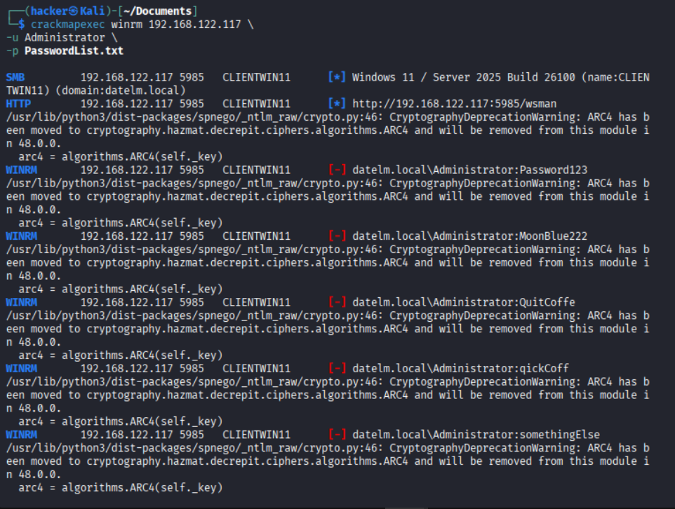

### Evil-WinRM

Nach erfolgreicher Erbeutung der Zugangsdaten wurde Evil-WinRM auf dem Kali-Linux-System eingesetzt, um eine PowerShell-Session auf dem Windows-11-System zu etablieren.

Evil-WinRM ist ein in Ruby entwickeltes Penetrationstesting-Tool, das WinRM (Windows Remote Management) nutzt, um Remote-Shells über Port 5985/5986 zu öffnen, ohne auf RDP oder SMB angewiesen zu sein. In Laborumgebungen wie HackTheBox stellt dies ein effizientes Werkzeug für Lateral Movement dar, sobald gültige Zugangsdaten vorliegen. Die Verwendung erfolgt mittels des Befehls „evil-winrm -i <IP> -u <User> -p <Pass>", wodurch eine interaktive PowerShell-Sitzung etabliert wird. Zu beachten ist, dass Firewalls oder Antivirenprogramme diese Verbindungen potenziell blockieren können.

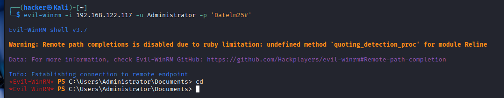

### Credential Capture mit Responder

Nach der Identifikation der Netzwerkkomponenten nutzte der Angreifer das Tool Responder auf Kali Linux, um eine LLMNR- und NBT-NS-Poisoning-Attacke durchzuführen, die darauf abzielt, fehlgeschlagene Namensauflösungsanfragen abzufangen und sensible Credentials zu erfassen. Responder wurde mit dem Befehl „responder -I eth0 -dw" gestartet, um auf dem Netzwerkinterface zu lauschen und rogue Server für LLMNR, NBT-NS und MDNS zu emulieren, die auf Anfragen von Windows-Systemen reagieren, wenn DNS-Auflösungen fehlschlagen.
Um die Attacke auszulösen, wurde auf dem Client-Gerät eine absichtliche Fehlanfrage simuliert, beispielsweise durch den Versuch, auf eine nicht existierende Ressource wie `\\wrong-folder` zuzugreifen, was das System dazu veranlasste, auf LLMNR/NBT-NS zurückzugreifen und eine Broadcast-Anfrage zu senden. Responder poisonte diese Anfrage, indem es sich als der angefragte Host ausgab, und forderte NTLM-Authentifizierung an, wodurch der NTLMv2-Hash des Basisbenutzers maxmustermann erbeutet wurde. Dieser Hash konnte anschließend offline mit Tools wie Hashcat geknackt werden, um das Passwort Datelm25# zu rekonstruieren. Bei einem 8-Zeichen-Passwort wie diesem hätte das Knacken mit einer RTX 4090 etwa 10–60 Minuten gedauert. Würde jedoch ein wirklich zufälliges Passwort mit 12 Zeichen verwendet werden, könnte das Knacken mehrere Tausend bis Millionen Jahre dauern und Offline-Cracking damit praktisch unmöglich machen. Genau das ermöglichte den Einstieg in die Domäne als normaler Benutzer. Diese Technik ist besonders effektiv in Windows-Netzwerken, da sie auf standardmäßigen Protokollen basiert und keine hohen Rechte erfordert, aber zu erheblichen Kompromittierungen führen kann, wenn sie nicht durch Gruppenrichtlinien deaktiviert wird.

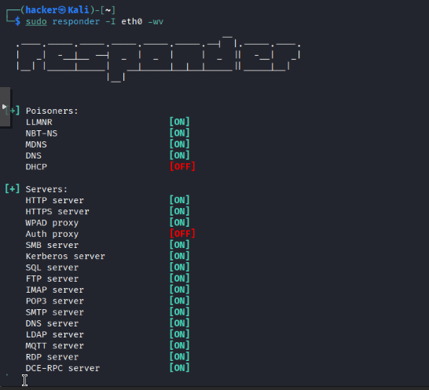

Im Windows-11-System wurde eine nicht existierende Netzwerkressource angefragt.

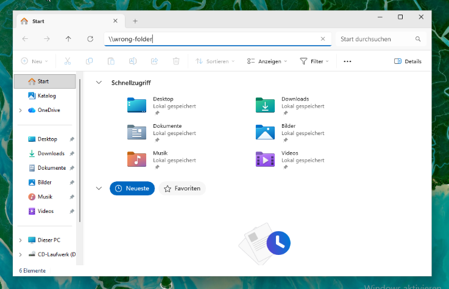

Responder fängt die Anfrage ab (Poisoning) und erfasst die Credentials.

Der NTLM-Hash wird gespeichert, um ihn offline zu knacken, wodurch die Erkennung durch Wazuh erschwert wird.

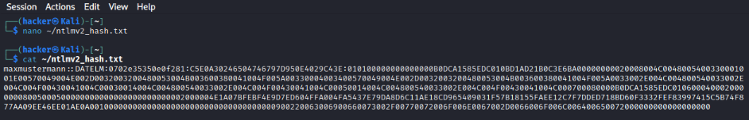

Mittels Hashcat wird der Hash offline mittels Brute-Force-Verfahren geknackt. Im Gegensatz zum Online-Cracking erzeugt dieser Vorgang keine Netzwerkaktivität und bleibt somit für verschiedene IDS unerkennbar.

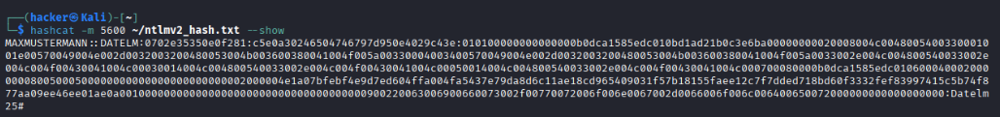

[@youtube_responder] `https://www.youtube.com/watch?v=qIsUCVvJ-3U` (siehe Anhang)

### Ausgangssituation

Nach dem erfolgreichen Capture der Credentials stand dem Angreifer nun ein normaler, nicht privilegierter Domänenbenutzer zur Verfügung, der durch die obigen Schritte erlangt wurde:

* Benutzername: maxmustermann
* Passwort: Datelm25#

Dieser Benutzer besitzt keinerlei administrative Rechte oder erweiterte Berechtigungen, was ihn zu einem typischen Konto mit niedrigen Privilegien (Low-Privilege-Account) macht. Dieses Szenario entspricht einem realistischen Angriffsfall, bei dem initiale Zugangsdaten durch Netzwerkpoisoning oder ähnliche Techniken erbeutet werden, und unterstreicht, wie Angreifer mit minimalem Ausgangszugang schrittweise eskalieren können.

### Durchführung des Kerberoasting-Angriffs

Zunächst wurde ein dedizierter Service Account mit einem zugehörigen Service Principal Name (SPN) im Active Directory konfiguriert, um eine authentische Umgebung zu schaffen. Service Accounts werden häufig für den Betrieb von Diensten wie Datenbanken oder Webservern verwendet und besitzen oft implizit oder explizit erhöhte Berechtigungen, was sie zu attraktiven Zielen macht.

Der Angreifer forderte mit einem standardmäßigen Kerberos-Request ein Service Ticket für diesen Account an, was ohne besondere Rechte möglich ist. Das erhaltene Ticket enthielt einen verschlüsselten Hash, der offline, also außerhalb des Netzwerks, analysiert werden konnte. Mithilfe des leistungsstarken Tools Hashcat wurde das Passwort des Service Accounts durch Brute-Force- oder Dictionary-Methoden erfolgreich rekonstruiert, oft innerhalb kurzer Zeit bei schwachen Passwörtern. Bei einem schwachen Passwort wie in diesem Fall hätte das Knacken mit einer RTX 4090 nur wenige Minuten bis maximal 1–2 Stunden gedauert. Bei einem wirklich zufälligen 12-Zeichen-Passwort würde es hingegen Tausende bis Millionen Jahre dauern und Offline-Cracking praktisch unmöglich machen.

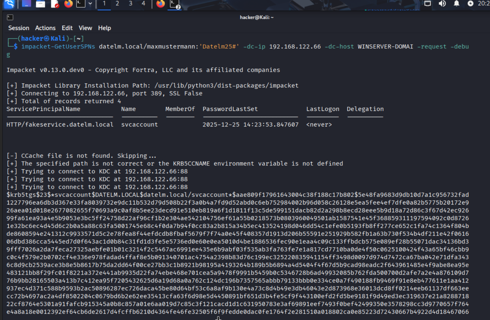

Nachdem wir das Ticket erhalten haben, wird es gespeichert und Hashcat erneut verwendet, um es offline zu knacken.

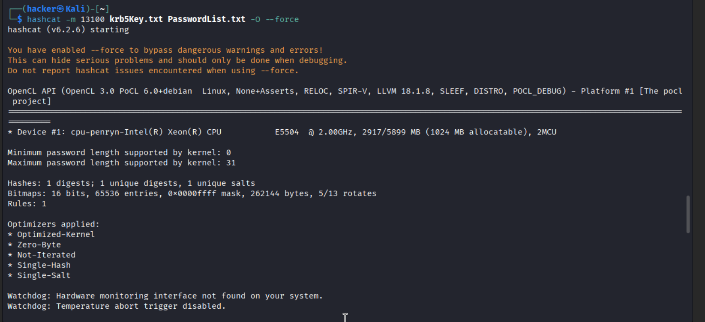

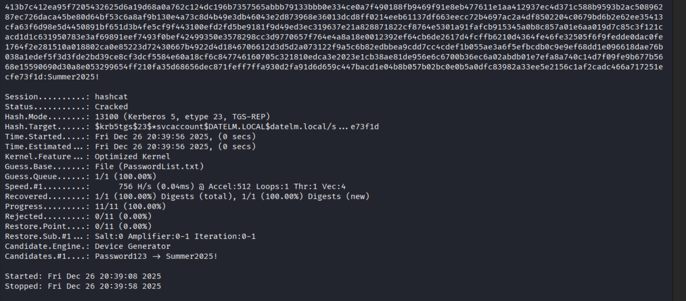

Dieser Schritt verdeutlicht, wie gefährlich schwache oder vorhersagbare Passwörter bei Service Accounts sind, da der Angriff keine besondere Berechtigung erfordert, vollständig offline abläuft und somit schwer zu erkennen ist, ohne spezialisierte Monitoring-Lösungen.

[@youtube_adlab1] https://www.youtube.com/watch?v=ZoGoBCviu6w (siehe Anhang)

### Privilegieneskalation mittels DCSync

Mit den nun kompromittierten Zugangsdaten des Service Accounts wurde ein DCSync-Angriff durchgeführt, der die legitime Replikationsfunktion von Active Directory ausnutzt. Dabei wurden Replikationsdaten direkt vom Domaincontroller angefordert, als ob es sich um eine normale Synchronisation zwischen Controllern handeln würde.

Als Ergebnis konnten sämtliche Passwort-Hashes der gesamten Domäne extrahiert werden, darunter auch der Hash des Administrators sowie des besonders kritischen krbtgt-Kontos, das für die Ticket-Signatur verantwortlich ist. Ab diesem Zeitpunkt war die Domäne als vollständig kompromittiert zu betrachten, da der Angreifer nun Zugriff auf alle sensiblen Credentials hatte und weitere Eskalationen einleiten konnte.

[@youtube_adlab2] https://www.youtube.com/watch?v=pbneELowUSA (siehe Anhang)

### Erstellen eines Golden Tickets

Anhand des extrahierten krbtgt-Hashes wurde ein Golden Ticket erzeugt, ein gefälschtes Kerberos Ticket Granting Ticket, das uneingeschränkten Zugriff ermöglicht. Dieses Ticket wurde speziell für den Administrator-Account erstellt und lokal auf dem Angreifersystem gespeichert, um es bei Bedarf zu verwenden.

Durch die Verwendung dieses Tickets war es möglich, sich als Domain Administrator auszugeben, ohne dass eine klassische Anmeldung am Domaincontroller erforderlich war oder Logs erzeugt wurden. Der Zugriff erfolgte vollständig über das Kerberos-Protokoll und war somit nur schwer zu erkennen, da es sich um eine legitime Authentifizierung handelt.

Das Goldene Ticket in eine Umgebungsvariable umwandeln, damit Impacket es nutzen kann. 'export KRB5CCNAME=/path/to/ticket.kirbi' so kann Impacket drauf zugreifen, ohne extra Params.
Ticket wird in eine Umgebungsvariable umgewandelt, damit Impacket es verwenden kann. Mittels „export KRB5CCNAME=/path/to/ticket.kirbi" kann Impacket auf das Ticket zugreifen, ohne dass zusätzliche Parameter erforderlich sind

[@youtube_adlab2] https://www.youtube.com/watch?v=pbneELowUSA (siehe Anhang)

### Erstellung und Einsatz eines Meterpreter-Payloads

Um eine Reverse-TCP-Verbindung zu einer Kali-Linux-Maschine herzustellen, wurde das Tool msfvenom aus dem Metasploit-Framework verwendet. Mithilfe von msfvenom lässt sich ein ausführbarer Payload generieren, der bei Ausführung auf dem Zielsystem eine Verbindung zum Angreifer zurück aufgebaut. Der Payload wurde bewusst einfach gehalten, um die Grundfunktionalität zu demonstrieren. In realen Szenarien würden zusätzliche Verschleierungstechniken (z. B. Encoder) eingesetzt, um Antivirenprogramme zu umgehen.

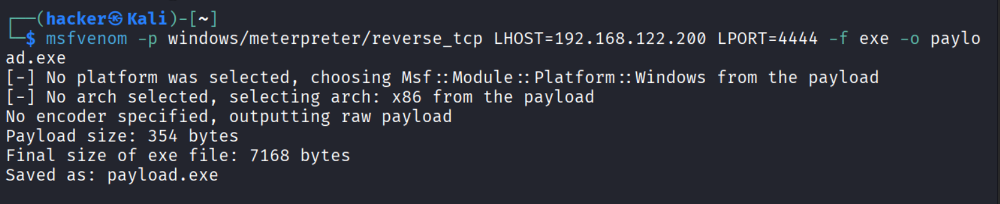

Um den Payload für das Zielsystem zugänglich zu machen, wurde auf der Kali-Maschine ein Apache-Webserver gestartet. Apache ermöglicht das einfache Hosten von Dateien, die über das lokale Netzwerk abgerufen werden können.

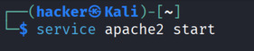

Nach der Erstellung wurde der Payload in das Webverzeichnis verschoben, um ihn für das Zielsystem zugänglich zu machen. Dies simuliert eine typische Angriffsmethode, bei der Malware über eine scheinbar harmlose Website verbreitet wird.

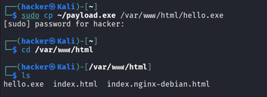

Auf der Windows-10-Maschine wurde der Payload über den Browser heruntergeladen. In der Praxis könnten Angreifer Social-Engineering-Techniken einsetzen, um Nutzer zum Download zu verleiten (z. B. gefälschte Software-Updates, manipulierte E-Mail-Anhänge oder Drive-by-Downloads).

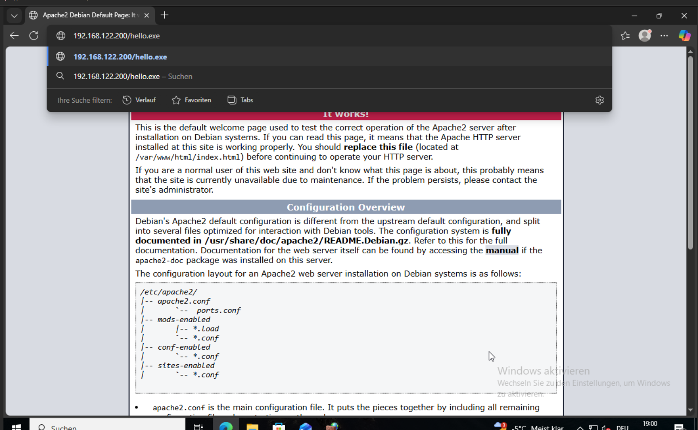

Nach dem Download wurde der Payload auf der Windows-10-Maschine ausgeführt. Dies kann manuell durch den Nutzer oder automatisch durch Skripte erfolgen. Sobald der Payload läuft, baut er eine Verbindung zur Kali-Maschine auf und öffnet eine Meterpreter-Session.

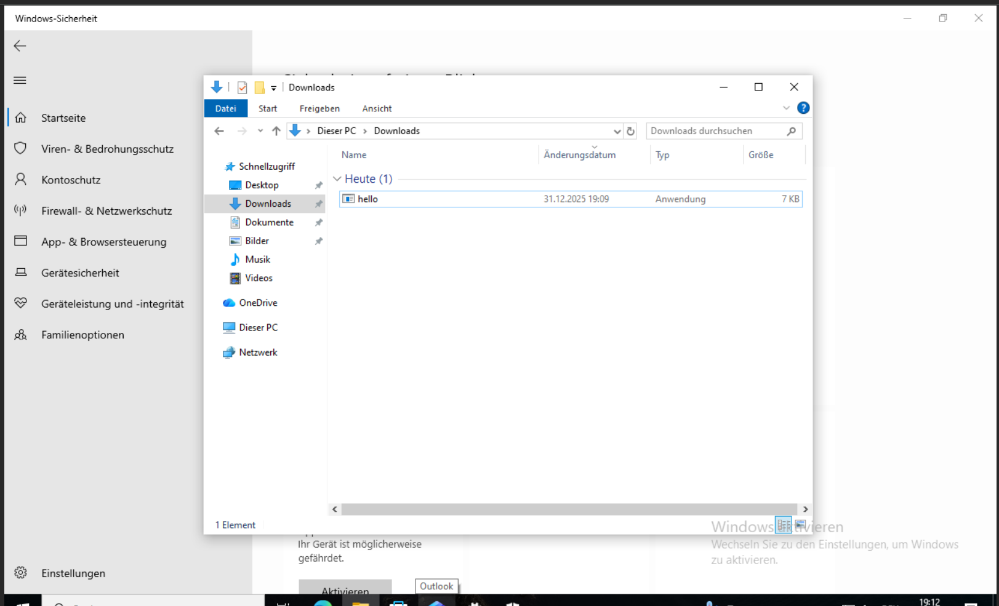

Meterpreter bietet eine Vielzahl von Post-Exploitation-Tools, darunter:

| Kategorie                    | Beschreibung                                                                 |
|-----------------------------|-------------------------------------------------------------------------------|
| Systeminformationen          | Auslesen von Benutzername, Betriebssystem und weiteren Systemdetails         |
| Dateiverwaltung              | Dateien herunterladen und hochladen                                           |
| Überwachung                  | Keylogging und Erstellung von Screenshots                                     |
| Persistenz                   | Einrichten von Persistenzmechanismen (z. B. Autostart-Einträge)               |
| Rechteeskalation             | Durchführung von Maßnahmen zur Rechteeskalation                               |

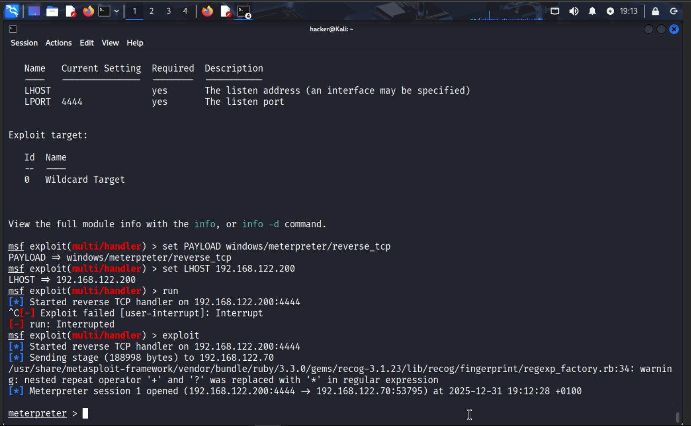

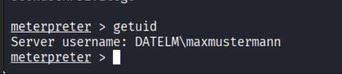

### Post-Exploitation und Persistenz

Nach der erfolgreichen Authentifizierung mit dem Golden Ticket konnten eine Vielzahl administrativer Aktionen im Netzwerk durchgeführt werden, die über die anfängliche Kompromittierung hinausgehen. Dazu gehörten unter anderem das Ausführen von Befehlen auf dem Domaincontroller, das Anlegen neuer Dienste für Backdoors oder das Manipulieren von Richtlinien, um langfristigen Zugriff zu sichern.

Dieser Schritt zeigt eindrucksvoll, wie Angreifer nach der initialen Kompromittierung langfristige Kontrolle über ein Netzwerk erlangen können, indem sie Persistence-Mechanismen etablieren, die eine Entdeckung erschweren und eine Wiederherstellung komplizieren.

### Erkennung durch Wazuh und Sysmon

Während des gesamten Angriffs wurden alle sicherheitsrelevanten Ereignisse durch die Kombination aus Sysmon für granulare Systemüberwachung und Wazuh für zentrale Log-Aggregation und -Analyse aufgezeichnet und in Echtzeit verarbeitet. Besonders auffällig waren dabei folgende Events, die typische Indikatoren für Angriffe darstellen:

* Kerberos Service Ticket Requests (Event ID 4769), die auf ungewöhnliche Ticket-Anfragen hinweisen.

* Directory Service Access Events (Event ID 4662), die Zugriffe auf sensible AD-Objekte protokollieren.	

*   Anmeldungen mit erhöhten Rechten (Event ID 4672), die Eskalationen signalisieren.

* Zusätzlich erfasste Sysmon Netzwerkscans (Event ID 3) und ungewöhnliche Broadcast-Anfragen, die auf Poisoning-Angriffe hindeuten.

Diese Logs wurden im Wazuh-Dashboard korreliert, visualisiert und ermöglichten eine detaillierte, schrittweise Rekonstruktion des gesamten Angriffspfades, einschließlich Timestamps und beteiligter Entitäten, was für Incident Response essenziell ist. Die einzelnen Events lieferten klare Indikatoren für die verschiedenen Phasen des Angriffs, von der Reconnaissance über die Privilegieneskalation bis hin zur Post-Exploitation, der Verlauf des Angriffs konnte somit lückenlos nachvollzogen werden. Zudem sind die Events direkte Hinweise auf die genutzten Techniken und Taktiken gemäß MITRE ATT&CK Framework, was die Analyse und das Verständnis der Angriffsvektoren erleichtert. Sie sind somit direkte Abhandlungen der Angriffe und nicht nur erscheinte Symptome. Solche Logs sollten nicht ignoriert werden, da sie wertvolle Informationen für die Erkennung und Abwehr zukünftiger Angriffe liefern. 

## Fazit

Diese Arbeit zeigt, dass ein vollständiger Active-Directory-Angriff auch ohne klassische Exploits möglich ist. Fehlkonfigurationen, schwache Passwörter und übermäßige Berechtigungen reichen aus, um eine Domäne vollständig zu kompromittieren.

Gleichzeitig wird deutlich, dass solche Angriffe mit geeigneten Monitoring-Systemen erkennbar sind. Eine Kombination aus Härtung der Active-Directory-Konfiguration und zentralem Logging stellt eine essenzielle Grundlage für die Absicherung moderner Unternehmensnetzwerke dar.

[@youtube_playlist_ad] [33] https://www.youtube.com/watch?v=kt_ipuQT0Fo&list=PLFA5k60XteClIkhV5_C-vUtQ59O6UcmkH (siehe Anhang)
